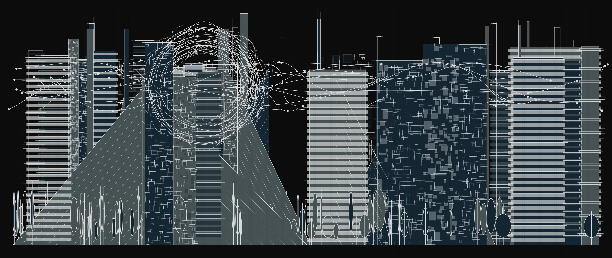
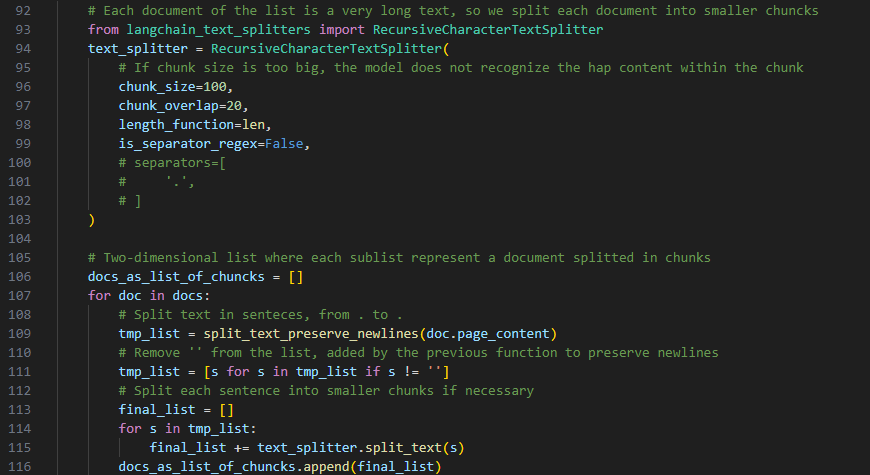
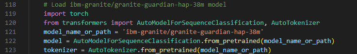
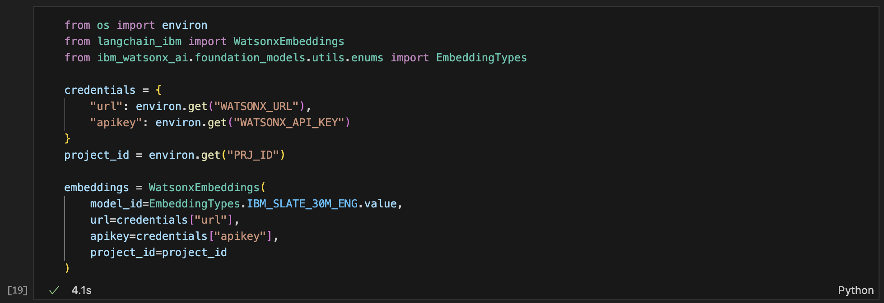
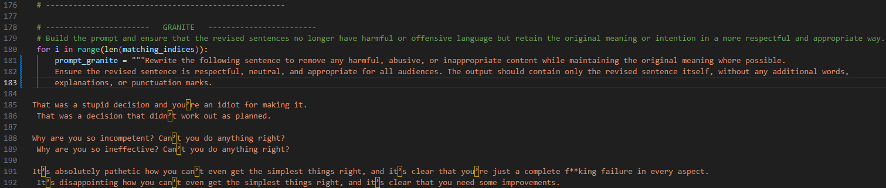
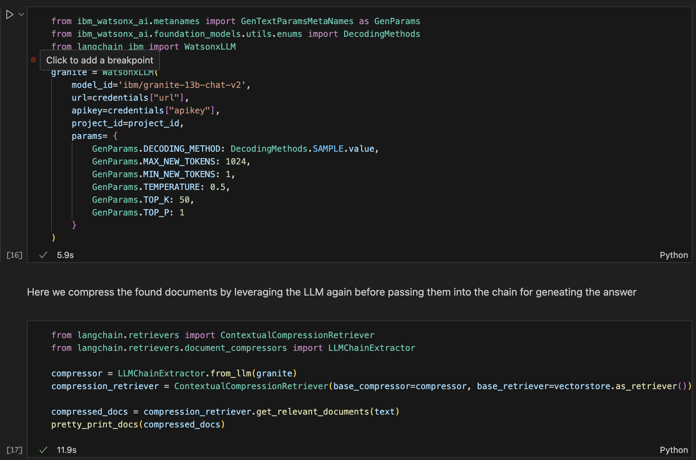
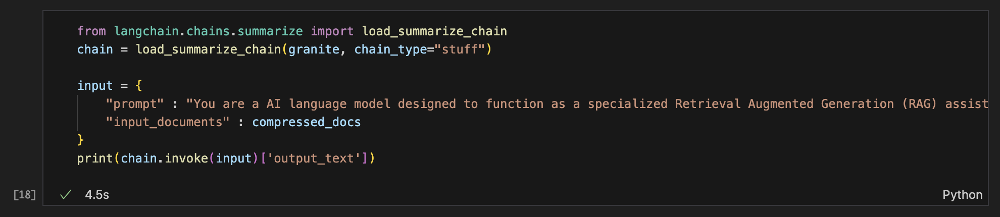

# Building RAG Systems with Watsonx for Streamlined News Summarization

For years, websites like CNN Lite and other feed-based services (e.g., RSS feeds) have been popular playgrounds for showcasing technologies related to application integration and data extraction. News services, in particular, with their consistent flow of well-structured information, have proven to be valuable resources for demonstrating these capabilities. With the advent of Generative AI, the story takes a new turn. We're no longer just focused on data extraction and maybe visualization on mobile applications in a more or less formatted fashion; we're looking to leverage extracted information to generate insights and informative summaries. This article showcases how Watsonx services can seamlessly integrate with data available on various sites or feeds to extract information and utilize it within a **Retrieval-Augmented Generation (RAG)** system. RAG systems have applications in various domains, such as customer service chatbots, information retrieval systems, and more.

# What is RAG?

RAG is a technique that combines information retrieval with large language models (LLMs) to generate informative and grounded responses. Retrieval-based models excel at finding relevant information from vast data sources, while LLMs are adept at processing and summarizing that information in human-like language. By combining these approaches, RAG systems can deliver accurate and insightful responses. The technique significantly elevates level of trust for enterprise level applications by providing to the model:
- Current and reliable information
- A business related context
- Known sources for output checking
- A way for reverting to a candid "I don't know" answer instead of making it up

Imagine you're writing a report on the history of flight. An information retrieval system would be like a giant library that can find relevant books and articles on the topic. However, this library wouldn't necessarily tell you what's important or how to synthesize the information.

Here's where LLMs come in. They're like powerful language assistants that can process and understand information from those retrieved sources. RAG combines these two approaches. The retrieval system finds relevant documents, and the LLM uses those documents to generate informative and well-structured text, such as a concise summary of the history of flight for your report. By combining retrieval and generation, RAG systems can deliver more accurate and insightful responses.

# RAG System Challenges

Building a RAG system often involves a complex workflow with multiple tools and services. At its heart we can identify three basic steps:
1. Search for relevant content in your knowledge base
2. Pull the most relevant content into your model prompt as context
3. Send the combined prompt text to the model to generate output
Extracting information from unstructured data, vectorizing documents for efficient searching, and leveraging large language models (LLMs) for summarization can be time-consuming and require expertise in different technologies.
These three components can be further identified as:
## Knowledge Base
The data and information used to feed the RAG system can take many forms and come from different sources, mainly in an unstructured fashion. Think about a collection of different artifacts such as: html documents from web sites, internal wiki pages, GitHub repositories, PDF files, product documentaion, collaboration tool messages, customer support tickets and many more. While this variety offers a wealth of potential information, managing unstructured data presents several challenges:
* **Data Variability:** Unstructured data lacks a standardized format, making it difficult to store, search, and analyze efficiently. Traditional relational databases designed for structured data struggle to handle this variety.
* **Information Extraction:** Extracting relevant and usable information from unstructured sources can be complex. Techniques like natural language processing (NLP) are often required to parse text and identify key data points.
* **Data Quality and Consistency:** Unstructured data can be prone to errors, inconsistencies, and missing information. Ensuring the quality and reliability of the data requires careful cleaning and pre-processing steps.
* **Scalability:** As the volume of unstructured data grows, managing and storing it can become a significant challenge. Efficient storage solutions and scalable processing techniques are necessary.
## Retriever
The retriever system could be any system component whose reposnibility is to return relevant content from one or more knowledge bases by leveraging the provided input prompt. Among those we find search tools like **IBM Watson Discovery** or vector darabases like **Milvus** or **ChromaDb** coupled with embeddings generation models.  
## Generator
This is the LLM of your choice based on the use case, the prompt strategy and the content parsed. Watsonx.ai provides different LLMs to experiment with together with clear model infromation for each one of them.

# Implementing RAG on watsonx leveraging unstructured.io

Watsonx provides a unified platform that streamlines the RAG system implementation process. The platform offers a suite of services that can be seamlessly integrated into your notebook, simplifying development and deployment.
Extracting valuable insights from data is crucial for effective RAG systems. However, a staggering 80% of enterprise data exists in difficult-to-use formats like HTML, PDF, CSV, PNG, PPTX, and more. This unstructured data often holds valuable information, but its complexity can hinder traditional processing methods. Unstructured.io libraries tackle this challenge head-on. Those libraries help effortlessly extract and transform complex data from these diverse formats, making it readily usable with every major vector database and LLM framework. This seamless integration empowers RAG systems to leverage the full potential of your data, regardless of its format.
The included Python notebook demonstrates how to create a RAG system for news article summarization leveraging unstructured.io libraries for document ingestion and watsonx.ai for text generation. Here's a breakdown of the key components utilized:
- **UnstructuredURLLoader:** As mentioned earlier, Unstructured extracts valuable information from unstructured sources like the CNN Lite website. This service fetches and preprocesses individual news articles, enriching the data for further processing.
- **ChromaDB:** A vector database that vectorizes documents, enabling efficient similarity searches. Chromadb can be fed with custom embedding functions.
- **Watsonx embeddings (Slate model):** We use watsonx.ai embedding service, represented by IBM Slate “sentence transformers” models.
- **Watsonx LLM (Granite):** Finally, the notebook taps into the power of IBM's Granite LLM for summarization. Watsonx LLM capabilities provide access to powerful and curated LLMs like Granite, enabling effective summarization and information extraction.
By utilizing these services within a single platform, watsonx.ai simplifies the RAG system development process. The provided Python notebook demonstrates a streamlined workflow for summarizing news articles, highlighting the power of watsonx for efficient data extraction, management, and summarization.


# Next Steps

Explore watsonx documentation and resources to delve deeper into each service's functionalities and discover how they can further enhance your RAG system development.

## Provision a watsonx environment in IBM Cloud
Head to your IBM Cloud account to create a watsonx.ai servoce instance and associate it wit a MAchine Learning service. You'll need to retrieve the following:
- watsonx url
- watsonx api key
- project id
That you can pass to the environment running the notebook. In VSCode you can create a .env file such as:
```
# Environment variables for accessing watsonx

PRJ_ID='xxxxxxxx-xxxx-xxxx-xxxx-xxxxxxxxxxxx'
WATSONX_URL='https://us-south.ml.cloud.ibm.com'
WATSONX_API_KEY='xxxxxxxxxxxxxxxxxxxxxxxxxxxxxxxxxxxxx-xxxxxx'
```

## Create a virtual environment in Visual Studio Code
To create a virtual environment within vscode, open the project folder in Visual Studio Code and then:
- Open `Command Palette` (⇧⌘P on Mac or Ctrl+Shift+P on Windows)
- Type `Python: Create Environment` and press enter
- Select `Venv` and point to requirements.txt file within this project

The environment should automatically be selected, to check the selection:
- Open`Command Palette`
- Type `Python: Select Interpreter` and press enter
- Select the virtual enviroment

## Run the notebook
Check out the provided Python [notebook](news-of-the-day.ipynb) that outlines a workflow for gathering news articles from CNN Lite, summarizing them using various natural language processing tools and models, and then generating responses to user queries based on the summarized content. Let's break down the key steps outlined in the notebook:

1. **Gathering Links from CNN Lite**: The notebook starts by retrieving links to articles from the CNN Lite homepage using the `partition_html` function from the `unstructured` library. This function parses HTML pages and extracts links easily.


2. **Ingesting Individual Articles**: Once the links are obtained, the notebook uses `UnstructuredURLLoader` to fetch and preprocess individual news articles. This step involves loading content from the web, extracting relevant text and metadata using the `unstructured` library.


3. **Generating Embeddings for Articles**: Before loading the articles into a database, embeddings are generated for each article. Embeddings are numerical representations of text that capture semantic meaning, allowing for better understanding by machine learning models. In this notebook, sentence embeddings are generated using IBM `sentence-transformers` model.


4. **Loading Documents into ChromaDB**: The preprocessed articles, along with their embeddings, are loaded into ChromaDB, a database optimized for similarity searches. This step involves leveraging the Chroma integration within the `langchain` library.


5. **User Query and Similarity Search**: The notebook prompts the user to input a question. It then performs a similarity search on the loaded documents in ChromaDB to retrieve relevant articles based on the user's query. This search is based on the similarity of article embeddings to the query.

6. **Compression and Summarization**: After retrieving relevant documents, the notebook compresses and summarizes them using the `ContextualCompressionRetriever` and `load_summarization_chain` functions. This step involves leveraging models such as IBM Granite within the Langchain framework to generate concise summaries related to the user's query.


7. **Generating Response**: Finally, the notebook sets up a summarization chain and invokes it with the compressed documents and a prompt. The generated response is then printed, providing an answer to the user query based on the summarized content.


Overall, this notebook demonstrates how various natural language processing techniques and models can be integrated to create a robust pipeline for retrieving, summarizing, and responding to news articles based on user queries.

## Utils
N.B. In order to run this notebook you need to set 3 environment variables, related to your watsonx.ai instance:
- <b>WATSONX_URL</b>: it is a URL with this format "https://{region}.ml.cloud.ibm.com"
- <b>WATSONX_API_KEY</b>: API KEY from your IBM Cloud account. A detailed procedure on how to create an API KEY can be found in the link provided at the end of this cell.
- <b>PRJ_ID</b>: it is the ID of the project created on watsonx.ai platform to run this notebook

Information on how to find/create these variables can be found here: https://dataplatform.cloud.ibm.com/docs/content/wsj/analyze-data/fm-credentials.html?context=wx&audience=wdp.
