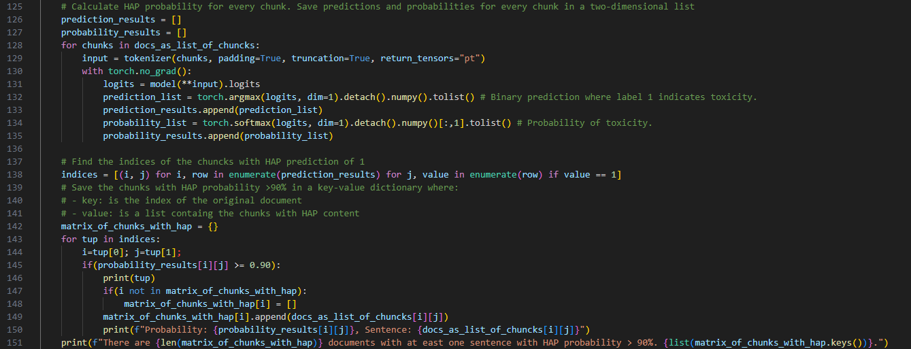

# Enanching RAG systems with HAP language filtering

The integration of a Hate, Abuse, and Profanity (HAP) language filters within Retrieval-Augmented Generation (RAG) systems is critical for ensuring the ethical and responsible use of large language models (LLMs).
Indeed, Large Language Models (LLMs) are central to many modern Natural Language Processing (NLP) tasks, but their reliance on vast amounts of data from the web poses a significant risk of generating harmful content. As highlighted by Christoph Tillmann and colleagues (reference), LLMs, including widely-used models like RoBERTa, can inadvertently produce hate, abuse, and profanity (HAP) content due to being trained on datasets that may contain offensive material​. In this context, the authors suggest different approaches to avoid such behaviors focusing on HAP filtering during models' training and alignment, in order to assure that an LLM does not rely on such language when producing content; furthermore, they also provide indication on how to deal with HAP filtering 
However, considering Retrieval-Augmented Generation (RAG) systems, where LLMs generate responses based on large document repositories, the risk of producing HAP content in response to a user query can also emerge from the presence of HAP language in the RAG system's knowledge base.

Hence, when it comes to filtering HAP content in the context of a RAG system, we can identify two primary approaches:

- Filtering the documents that are ingested into the RAG system, ensuring the knowledge base remains free of HAP language (pre-processing approach).
- Filtering the model’s output to sanitize responses, reducing the risk of harmful content being generated (post-processing approach).

Each method has its own benefits and challenges. Filtering documents during ingestion ensures that harmful content is never introduced into the knowledge base, preventing the possibility of such content being retrieved or surfaced in the model’s output. On the other hand, filtering the output of the LLM can be useful in cases where harmful language is inadvertently generated or inferred based on user queries, but this approach does not preclude the system from retrieving or working with problematic content behind the scenes.

However, most existing HAP filters focus on removing harmful content entirely, which poses its own challenges. By stripping away HAP content, valuable information or context, which may be crucial in sensitive domains such as law enforcement or social work, could be lost. For instance, an important document discussing hate speech could be discarded entirely, despite having substantial insights.

In this article, we will show how to easily implement a pipeline that identifies HAP language within documents intended for ingestion (pre-processing approach) and, rather than discarding these sections, pass the flagged content to an LLM, which will rephrase the HAP elements into a more appropriate form while preserving the original meaning and context. The cleaned documents can then be ingested into the RAG system, ensuring both the integrity of the knowledge base and the ethical use of language. This approach not only safeguards the user experience but also maximizes the amount of usable, meaningful content available to the system.

An high level overview of the pipeline described in this article is provided by the following diagram:

In doing so, we expand our [preavious work](https://github.com/matteorinalduzzi/RAG-with-watsonx) on how to build a RAG system leveraging IBM Granite Guardian, a highly effective classifier for identifying hate, abuse, and profanity (HAP) content [recently open-sourced by IBM Research](https://research.ibm.com/blog/efficient-llm-hap-detector), for classifing HAP content within the knowledge base. Trained on large-scale datasets, IBM Granite Guardian boasts a lightweight model with only 38 million parameters, allowing it to deliver accurate HAP detection for the english language with lower computational requirements. Its streamlined performance ensures quick and reliable identification of harmful content, making it an ideal tool for real-time applications in content moderation, while maintaining the scalability needed for large RAG systems. 

# Identify HAP content in the knowledge base using IBM Granite Guardian and transform it using IBM Granite-13B-instruct in watsonx.ai

In order to introduce the pre-processing needed for the implementation of the HAP filter, as well as the IBM Granite Guardian model itself, with minimal modifications to our previous notebook, we define some helper functions provided in the hap_utilities.py file.

In particular we define some basic pre-processing functions in order to handle our chuncks of text while passing it to a filter, transform it when appropriate and re-build the documents with the transformed chunks of text (i.e. split_text_preserve_newlines, rebuild_text_with_newlines and find_substring_indices). Last but not least, we introduce a new function (i.e. clean_hap_content) that combines such new functions to performs a series of steps in order to clean out the HAP content from our documents.

First, the function processes the documents in order to create chuncks that can be evaluated by the HAP classifier:

Then the function loads the IBM Granite Guardian 38M model, which can be easily pulled from [its HuggingFace Repository](https://huggingface.co/ibm-granite/granite-guardian-hap-38m).

The model take strings of text as input and compute the probability that the processed text may contain HAP language: in its basic settings, if the probability associated to a string is higher than 0.5, the string is classified as 1 (indicating that it may contain HAP language), otherwise it is classified as 0 (i.e. no HAP content detected). For the sake of our analysis, we decide to select only the chuncks of text presenting a probability higher than 0.9 but the code can be easily adapted in order to select the preferred treshold for the specific use case:

Once we have identified the chuncks on text containing HAP language, we can finally pass these chuncks to the IBM Granite 13 Billions Instruct foundational model in watsonx.ai, which will transform such chuncks rephrasing the harmful content using the following prompt:

Once we have defined the helper functions, the original notebook is only updated with one line of code in order to pre-process the documents before being inserted into ChromaDB and while the rest of the code will perform the same operations as in the original work:

# Conclusions

In this brief article we outlined how to easily implement a filter able to detect and trasform potentially harmful language in our RAG knowledge base leveraging the open-source IBM Granite Guardian model. As demostrated by the execution of this simple code, such model can be easily deployed on consumer grade hardware reducing the costs potentially associated with the use of larger, generalistic LLMs, allowing for a more efficient use of resources and freeing up space for the use of larger model to address different tasks (such as the re-phrasing of the identified harmful content). Furthermore, the implementation of the re-phrainsing mechanism for the identified HAP content overcomes the issues potentially raised by a complete removal of the information carried by the harmful content.
